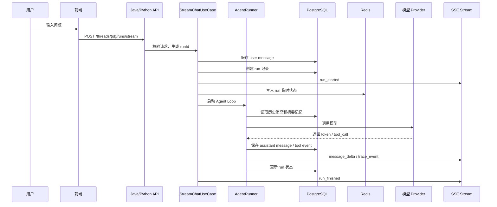
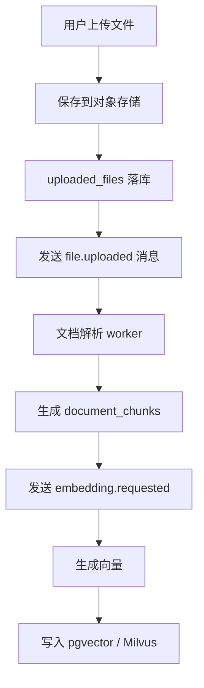
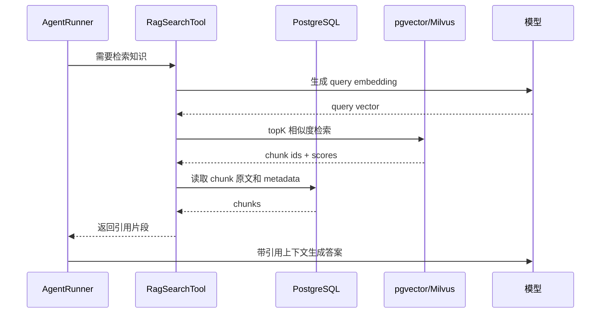
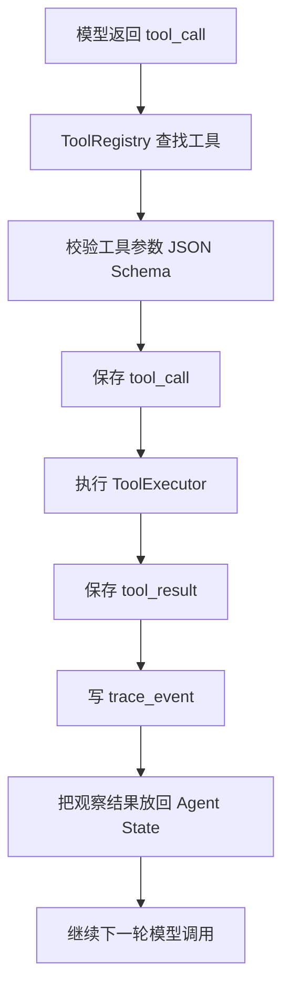

# 数据流转、存储与 Agent Loop 方案

> 本文件回答一个核心问题：  
> 一次用户请求从前端进入后，数据如何流转、保存、缓存、异步处理、进入 RAG、进入上下文、进入 Agent Loop。

## 1. 总体结论

学习版不要一开始堆太多中间件。

如果只有单机服务器，优先按 `10_SINGLE_NODE_ENTERPRISE_ARCH_ZH.md` 的 profile 方案部署。

实际运行只承诺 `2 核 4G core profile`。  
集群化表达和面试回答见 `11_INTERVIEW_CLUSTER_DESIGN_ZH.md`。

推荐路线：

```text
Phase 1-3：
PostgreSQL + Redis + 本地文件目录

Phase 4-8：
PostgreSQL + Redis + MinIO + Redis Streams / RabbitMQ

Phase 9-12：
PostgreSQL + pgvector + Redis + MinIO + RabbitMQ

规模化后：
PostgreSQL + Redis + MinIO + Kafka + Milvus
```

单机大厂模拟路线：

```text
core：
PostgreSQL + pgvector + Redis + Nginx/Caddy

enhanced：
core + MinIO + RabbitMQ + OTel + Prometheus + Grafana

optional：
Milvus / Kafka 只在资源足够时启用，默认用 pgvector / Redis Streams 跑通同等架构形态
```

替代规则：

```text
Kafka 不硬上，但 EventBusPort + Redis Streams 必须能跑。
Milvus 不硬上，但 VectorStorePort + pgvector 必须能跑。
ELK 不硬上，但中文结构化日志 + trace_events 查询必须能跑。
Kubernetes 不硬上，但 Docker Compose profiles 必须能跑。
S3 不硬上，但 ObjectStoragePort + 本地目录 / MinIO 必须能跑。
```

默认选型：

| 类型 | 学习版默认 | 规模化替代 | 原因 |
| --- | --- | --- | --- |
| 主数据库 | PostgreSQL | PostgreSQL 分库 / 云 RDS | 事务、JSONB、全文检索、pgvector 都方便 |
| 缓存 | Redis | Redis Cluster | 会话临时态、限流、分布式锁、短期结果缓存 |
| MQ | Redis Streams / RabbitMQ | Kafka | 文件解析、Embedding、评测、通知适合异步 |
| 文件存储 | 本地目录 | MinIO / S3 / OSS | 文档、图片、导出报告不能放数据库 |
| 向量存储 | pgvector | Milvus | 学习版简单，规模化后 Milvus 更专业 |
| 日志检索 | 控制台 + 文件 | Loki / ELK | 先看懂日志，再做平台化 |
| Trace | 数据库表 | OTel + Tempo | 先把事件模型跑通 |

不建议：

```text
不建议用 MongoDB 做主库。
不建议一开始上 Kafka。
不建议一开始上 Milvus。
不建议把聊天消息、文件、向量、Trace 全塞进一个表。
```

MongoDB 可以作为文档型扩展存储，但本项目第一主库更适合 PostgreSQL。

## 2. 核心数据分类

一次 Agent 运行会产生多类数据。

```text
用户数据：
Thread、Message、UploadedFile

运行数据：
Run、RunStep、ToolCall、ToolResult、TraceEvent

模型数据：
ModelProvider、ModelConfig、ModelUsage、FallbackRecord

记忆数据：
ShortTermMemory、SummaryMemory、LongTermMemory

RAG 数据：
Document、DocumentChunk、Embedding、VectorIndex

运维数据：
ApiKeyConfig、AuditLog、HealthCheck、DeploymentRecord
```

保存原则：

1. 用户可见的数据必须落主库。
2. 运行过程事件必须能回放。
3. 大文件只存对象存储，数据库只存元数据。
4. 向量不和原文强绑定在同一张业务表里。
5. 缓存只做加速，不做最终事实来源。

## 3. 一次聊天请求的数据流



关键点：

1. 前端通过 SSE 接收流式事件。
2. 后端边生成边推送，同时把关键事件落库。
3. Redis 保存短生命周期状态，例如 run 是否取消、当前步骤、限流计数。
4. PostgreSQL 保存最终可追溯数据。

## 4. 主库方案：PostgreSQL 优先

### 4.1 为什么不是 MySQL

MySQL 可以做，但学习 Agent Harness 时 PostgreSQL 更省心：

1. JSONB 适合保存模型响应、工具参数、Trace payload。
2. pgvector 可以直接做学习版 RAG。
3. 事务和复杂查询都强。
4. 后续迁移到云 PostgreSQL 或 Supabase/RDS 很自然。

MySQL 适合你已有公司技术栈强绑定 MySQL 的情况。

### 4.2 为什么不是 MongoDB

MongoDB 的灵活文档模型看起来适合 message 和 trace，但问题是：

1. 线程、消息、运行、工具调用之间存在明确关系。
2. Trace、评测、统计需要很多聚合查询。
3. 事务一致性和 SQL 报表对学习工程化更重要。
4. Java/Python 双后端更容易用 SQL contract 对齐。

MongoDB 可以后续作为扩展：

```text
存非结构化模型原始响应
存复杂工具返回快照
存长文档解析中间结果
```

但不作为第一主库。

### 4.3 核心表规划

```text
users
threads
messages
runs
run_steps
trace_events
tool_calls
tool_results
model_usage
fallback_records
uploaded_files
documents
document_chunks
memory_summaries
long_term_memories
audit_logs
```

关键字段建议：

```text
threads:
  id, title, created_at, updated_at, runtime, metadata_json

messages:
  id, thread_id, role, content, content_type, token_count, created_at

runs:
  id, thread_id, status, runtime, model_provider, model_name, started_at, finished_at, error_message

trace_events:
  id, run_id, event_type, step_no, payload_json, created_at

document_chunks:
  id, document_id, chunk_index, content, token_count, metadata_json
```

## 5. 缓存方案：Redis 做短期态

Redis 不做最终数据源，只做加速和临时状态。

适合放 Redis：

```text
run:{runId}:state              当前运行状态
run:{runId}:cancel             用户是否取消
thread:{threadId}:recent       最近 N 条消息缓存
model:{provider}:health        模型健康状态
rate:{userId}:{minute}         限流计数
tool:{name}:{inputHash}        工具短期结果缓存
rag:{queryHash}                RAG 查询短期缓存
lock:thread:{threadId}         同一会话并发锁
```

不适合放 Redis：

```text
完整聊天历史
长期记忆
文件内容
向量数据
审计日志
计费记录
```

缓存失效策略：

1. run 状态：1 小时过期。
2. recent messages：10 分钟过期。
3. 工具结果：按工具类型设置 1 分钟到 1 天。
4. 模型健康：30 秒到 5 分钟。
5. RAG 查询结果：5 到 30 分钟。

## 6. MQ 方案：先少用，后补强

聊天主链路先不要依赖 MQ。

原因：

```text
SSE 流式对话要求低延迟。
初学阶段先看懂同步 Agent Loop。
MQ 会增加排查复杂度。
```

应该进入 MQ 的任务：

```text
文件解析
文档切片
Embedding 生成
向量入库
长对话摘要
异步评测
审计归档
通知
模型调用慢日志分析
```

推荐演进：

```text
学习版：Redis Streams
工程版：RabbitMQ
大流量版：Kafka
```

消息主题建议：

```text
file.uploaded
document.parse.requested
document.chunk.requested
embedding.requested
vector.upsert.requested
memory.summary.requested
eval.run.requested
trace.archive.requested
```

必须遵守：

1. MQ 消息必须有 `eventId`。
2. 消费者必须幂等。
3. 失败必须进入重试或死信。
4. 不允许只打印异常然后丢消息。

## 7. 文件与对象存储

文件不要直接存数据库。

学习版：

```text
mimic-harness/data/uploads/
```

工程版：

```text
MinIO
```

云服务器版：

```text
MinIO / 阿里云 OSS / 火山 TOS / 腾讯 COS
```

数据库只保存：

```text
file_id
bucket
object_key
filename
content_type
size
sha256
upload_user_id
created_at
```

文件处理流：



## 8. RAG 向量存储方案

向量库这里统一按 Milvus 讨论。

本项目建议两阶段：

```text
学习版：PostgreSQL + pgvector
规模化版：Milvus
```

### 8.1 pgvector 适合什么

适合：

```text
本地学习
单机 Docker
中小规模文档
快速理解 RAG 全链路
```

优点：

1. 少一个中间件。
2. SQL 能直接关联 document_chunks。
3. 容易备份和部署。

### 8.2 Milvus 适合什么

适合：

```text
百万级 chunk
高并发检索
多 collection
复杂索引
向量服务独立扩容
```

缺点：

1. 部署和排查更复杂。
2. 初学阶段容易把注意力从 Agent Loop 带偏。
3. 仍然需要主库保存文档元数据。

### 8.3 RAG 查询流



RAG 结果必须带：

```text
documentId
chunkId
score
sourceName
contentSnippet
```

否则前端无法展示引用来源。

## 9. 上下文管理方案

上下文不是简单把历史消息全部塞给模型。

推荐分层：

```text
System Prompt
Developer Rules
Current User Message
Recent Messages
Summary Memory
Long Term Memory
RAG Context
Tool Results
Runtime State
```

上下文组装顺序：

```text
1. 固定系统提示词
2. 当前任务目标
3. 最近 N 轮对话
4. 会话摘要
5. 长期记忆召回
6. RAG 文档片段
7. 工具执行结果
8. 输出格式约束
```

Token 预算建议：

```text
system + rules：10%
recent messages：30%
summary memory：15%
RAG context：30%
tool results：10%
保留输出空间：5%
```

上下文裁剪规则：

1. 最新用户问题永远不裁。
2. 系统规则永远不裁。
3. 工具结果优先保留结构化摘要。
4. RAG 片段按 score 和多样性筛选。
5. 历史消息超长时先摘要，再裁旧消息。

## 10. Memory 方案

Memory 分三类：

```text
短期记忆：最近几轮消息，来自 messages 表和 Redis 缓存
摘要记忆：长对话压缩摘要，保存到 memory_summaries
长期记忆：用户偏好、长期事实，保存到 long_term_memories
```

摘要触发条件：

```text
消息超过 N 轮
token 超过阈值
run 完成后异步触发
用户显式要求记住
```

长期记忆必须谨慎：

1. 不自动保存敏感信息。
2. 用户可查看和删除。
3. 保存时记录来源消息。
4. Java/Python 两套实现必须共用同一套 memory contract。

## 11. Agent Loop 方案

本项目先实现手写 loop，再接框架。

推荐状态机：

```text
CREATED
CONTEXT_LOADING
PLANNING
MODEL_CALLING
TOOL_DECIDING
TOOL_RUNNING
OBSERVING
ANSWERING
FINISHED
FAILED
```

基础循环：

```text
1. 创建 Run
2. 加载 Thread + Memory + RAG
3. 组装上下文
4. 调用模型
5. 判断是否需要工具
6. 执行工具
7. 把观察结果放回上下文
8. 继续调用模型
9. 达到完成条件后输出最终答案
10. 保存消息、Trace、Usage
```

伪代码：

```text
while not finished:
  emit trace_event
  context = context_builder.build(state)
  model_output = llm_client.chat(context)

  if model_output.has_tool_call:
    tool_result = tool_executor.execute(model_output.tool_call)
    state.add_observation(tool_result)
    continue

  if model_output.is_final_answer:
    save_answer(model_output)
    finished = true
```

Loop 必须有保护：

```text
max_steps
max_tool_calls
max_tokens
timeout
cancel signal
fallback policy
异常转中文错误
```

每一步必须产生 TraceEvent：

```text
context_loaded
model_selected
model_call_started
model_call_finished
tool_call_started
tool_call_finished
fallback_triggered
run_finished
run_failed
```

## 12. Tool Calling 数据流



工具执行规则：

1. 所有工具必须有 schema。
2. 所有工具必须有 timeout。
3. 所有工具错误必须转成 ToolExecutionException。
4. 工具结果不能无限大，必须摘要或截断。
5. 工具调用入参和结果要进 Trace，但敏感字段要脱敏。

## 13. Multi-Agent 数据流

Multi-Agent 不是多个线程乱跑。

第一版建议：

```text
SupervisorAgent 单线程编排
SpecialistAgent 顺序执行
共享同一个 RunState
每次 handoff 都写 Trace
```

数据流：

```text
用户问题
  -> Supervisor 判断任务类型
  -> ChatAgent / ToolAgent / RagAgent / VisionAgent
  -> CriticAgent 审查
  -> Supervisor 汇总最终答案
```

保存：

```text
run_steps.agent_name
run_steps.input_json
run_steps.output_json
trace_events.agent_handoff
```

后续再考虑并行 Agent 和 MQ 编排。

## 14. 最终推荐架构

学习阶段最终形态：

```text
前端 Next.js
  -> Java Spring Boot Agent
  -> Python FastAPI Agent
  -> PostgreSQL + pgvector
  -> Redis
  -> MinIO
  -> RabbitMQ
  -> OTel Collector
```

主链路：

```text
用户请求 -> API -> Agent Loop -> 模型/工具/RAG -> SSE -> 前端
```

异步链路：

```text
文件上传 -> MQ -> 解析 -> 切片 -> Embedding -> 向量入库
```

持久化链路：

```text
Message / Run / Trace / Tool / Memory -> PostgreSQL
File -> MinIO
Vector -> pgvector / Milvus
Temp State / Cache / Lock -> Redis
Async Event -> RabbitMQ / Kafka
```

## 15. 开发优先级

不要同时开工所有中间件。

顺序应该是：

```text
1. PostgreSQL 表结构和 Repository
2. Redis run state 和 cancel signal
3. Agent Loop TraceEvent 落库
4. 文件上传元数据
5. pgvector RAG
6. MQ 异步文档处理
7. MinIO 对象存储
8. Milvus adapter
9. Kafka adapter
```

这样能保证每一步都能跑通，而不是一开始被基础设施拖住。
