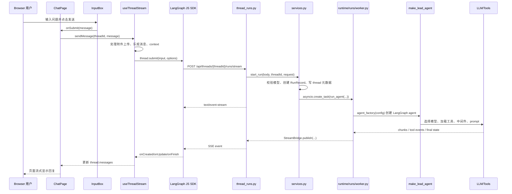

# DeerFlow 全链路阅读指南（给 Java 开发）

这份文档按“浏览器入口 -> 前端组件 -> 前端 API 封装 -> 后端路由 -> 后端服务 -> LangGraph agent -> 模型/工具 -> SSE 回前端”的顺序梳理。你可以把它类比成 Spring Boot 项目：

- `frontend/src/app/**/page.tsx`：页面路由，类似 Controller 对应的页面入口。
- `frontend/src/core/**/api.ts`：前端 REST 客户端，类似调用后端接口的 Feign/RestTemplate 封装。
- `backend/app/gateway/routers/*.py`：FastAPI router，类似 Spring `@RestController`。
- `backend/app/gateway/services.py`：运行链路 Service 层。
- `backend/packages/harness/deerflow/**`：核心业务引擎，负责创建 agent、调用模型、调工具、写记忆/文件。

## 1. 本地服务拓扑

Docker dev 模式下有三个核心容器：

| 容器 | 作用 | 常见端口 |
| --- | --- | --- |
| `deer-flow-nginx` | 对外统一入口，转发到前端和后端 | `localhost:2026` |
| `deer-flow-frontend` | Next.js 前端 | 容器内 `3000` |
| `deer-flow-gateway` | FastAPI 后端 gateway | 容器内 `8001` |

浏览器访问：

```text
http://localhost:2026
```

Next.js 内部 rewrite 规则在 `frontend/next.config.js`：

- `/api/langgraph/*` -> gateway `/api/*`
- `/api/agents/*` -> gateway `/api/agents/*`
- `/api/:path*` -> gateway `/api/:path*`

所以前端代码里很多请求写的是相对路径 `/api/...`，但实际会被 Next.js 转到后端 gateway。

## 2. 前端入口地图

| 页面 | 文件 | 作用 |
| --- | --- | --- |
| 首页 | `frontend/src/app/page.tsx` | landing page |
| 登录 | `frontend/src/app/(auth)/login/page.tsx` | 登录页 |
| 初始化管理员 | `frontend/src/app/(auth)/setup/page.tsx` | 首次 setup |
| 工作区总布局 | `frontend/src/app/workspace/layout.tsx` | 鉴权、跳转、workspace 外壳 |
| 普通聊天 | `frontend/src/app/workspace/chats/[thread_id]/page.tsx` | 聊天主页面 |
| 新建聊天 | `/workspace/chats/new` | 同一个聊天页面，前端临时生成 threadId |
| 智能体列表 | `frontend/src/app/workspace/agents/page.tsx` | 展示 custom agents |
| 创建智能体 | `frontend/src/app/workspace/agents/new/page.tsx` | 先校验名字，再 bootstrap 对话 |
| 和某个智能体聊天 | `frontend/src/app/workspace/agents/[agent_name]/chats/[thread_id]/page.tsx` | 带 `agent_name` 的聊天 |

## 3. 普通聊天全链路

### 3.1 时序图



### 3.2 前端从哪里发起

普通聊天页面入口：

```text
frontend/src/app/workspace/chats/[thread_id]/page.tsx
```

关键代码：

- `useThreadChat()`：从 URL 里取 `thread_id`，如果是 `/new` 就先生成一个临时 UUID。
- `useThreadStream(...)`：绑定 LangGraph streaming 状态。
- `handleSubmit(...)`：把 `InputBox` 的输入交给 `sendMessage(...)`。

实际发送逻辑在：

```text
frontend/src/core/threads/hooks.ts
```

关键函数：

```ts
useThreadStream(...).sendMessage(...)
```

它做了几件事：

1. 给用户消息加 optimistic UI，也就是后端还没回时，前端先把用户输入显示出来。
2. 如果有附件，先调用上传接口。
3. 组装 LangGraph input：

```ts
{
  messages: [
    {
      type: "human",
      content: [{ type: "text", text }],
      additional_kwargs: { files }
    }
  ]
}
```

4. 组装 DeerFlow context：

```ts
{
  model_name,
  mode,
  thinking_enabled,
  is_plan_mode,
  subagent_enabled,
  reasoning_effort,
  thread_id
}
```

5. 调用：

```ts
thread.submit(input, options)
```

这里的 `thread` 来自 LangGraph React SDK 的 `useStream`。

### 3.3 前端实际调用了哪个后端接口

LangGraph SDK 客户端在：

```text
frontend/src/core/api/api-client.ts
```

`getLangGraphBaseURL()` 默认返回：

```text
/api/langgraph
```

Next.js rewrite 后，gateway 实际收到：

```http
POST /api/threads/{thread_id}/runs/stream
```

这个接口在：

```text
backend/app/gateway/routers/thread_runs.py
```

方法：

```py
@router.post("/{thread_id}/runs/stream")
async def stream_run(...)
```

### 3.4 后端接口做了什么

`stream_run(...)` 自己很薄，类似 Controller：

1. 权限校验：`@require_permission("runs", "create", owner_check=True, require_existing=True)`
2. 获取 `StreamBridge` 和 `RunManager`
3. 调用 Service：

```py
record = await start_run(body, thread_id, request)
```

4. 返回 `StreamingResponse(...)`，Content-Type 是：

```text
text/event-stream
```

也就是 SSE。前端看到的打字机效果就是这个流。

### 3.5 Service 层做了什么

文件：

```text
backend/app/gateway/services.py
```

核心方法：

```py
async def start_run(body, thread_id, request) -> RunRecord
```

职责：

1. 从 `request.app.state` 拿运行期单例：`StreamBridge`、`RunManager`、`RunContext`。
2. 从请求 `context` 中取 `model_name`，检查是否在 `config.yaml` 的 `models` 白名单里。
3. 检查当前用户是否有权限访问这个 thread。
4. 创建 `RunRecord`，相当于一条“运行任务记录”。
5. upsert thread 元数据，让侧边栏能搜到这个会话。
6. `normalize_input(...)`：把前端传来的 message dict 转成 LangChain message。
7. `build_run_config(...)`：把 `thread_id`、`agent_name`、`model_name`、`mode` 等写进 LangGraph config/context。
8. 后台启动：

```py
asyncio.create_task(run_agent(...))
```

注意：HTTP 请求不会同步等待模型完整跑完。它一边返回 SSE，一边后台跑 agent。

### 3.6 真正执行 agent 的地方

文件：

```text
backend/packages/harness/deerflow/runtime/runs/worker.py
```

核心方法：

```py
async def run_agent(...)
```

职责：

1. 标记 run 为 running。
2. 发布 metadata 事件，告诉前端 `run_id` 和 `thread_id`。
3. 构建 LangGraph runtime/context。
4. 调用 agent factory：

```py
agent = agent_factory(config=runnable_config)
```

这里的 factory 通常是：

```text
backend/packages/harness/deerflow/agents/lead_agent/agent.py
make_lead_agent(...)
```

5. 给 agent 挂 checkpointer/store。
6. 调：

```py
agent.astream(graph_input, config=runnable_config, stream_mode=...)
```

7. 每拿到一个 LangGraph chunk，就：

```py
bridge.publish(run_id, sse_event, serialize(chunk, mode=mode))
```

8. Controller 里的 `sse_consumer(...)` 会订阅 bridge，再把事件写回浏览器。

### 3.7 agent 是怎么创建的

文件：

```text
backend/packages/harness/deerflow/agents/lead_agent/agent.py
```

核心方法：

```py
make_lead_agent(config)
_make_lead_agent(config, app_config=...)
```

它做的事：

1. 从 runtime config/context 里读：

```text
model_name
mode
thinking_enabled
reasoning_effort
is_plan_mode
subagent_enabled
agent_name
is_bootstrap
```

2. 如果有 `agent_name`，加载对应自定义智能体配置：

```text
users/{user_id}/agents/{agent_name}/config.yaml
users/{user_id}/agents/{agent_name}/SOUL.md
```

3. 解析最终模型名：

```py
_resolve_model_name(...)
```

如果没有任何模型，会报：

```text
No chat models are configured. Please configure at least one model in config.yaml.
```

4. 构建工具列表：

```py
get_available_tools(...)
```

5. 构建 middleware 链，比如：

- 动态上下文
- skill 激活
- 总结压缩
- Todo
- token usage
- 标题生成
- memory
- 图片理解
- subagent 限制
- 循环检测
- clarification

6. 最后调用 LangChain：

```py
create_agent(model=..., tools=..., middleware=..., system_prompt=..., state_schema=ThreadState)
```

### 3.8 模型实例在哪里创建

文件：

```text
backend/packages/harness/deerflow/models/factory.py
```

核心方法：

```py
create_chat_model(...)
```

它从 `config.yaml` 的 `models` 里找到对应配置，然后用 `use` 指定的类创建模型。例如：

```yaml
models:
  - name: gpt-4o
    use: langchain_openai:ChatOpenAI
    model: gpt-4o
    api_key: $OPENAI_API_KEY
```

这里 `$OPENAI_API_KEY` 会从环境变量读取。你本地 `.env` 里必须是真实 key，否则配置能加载，但真正调用模型会失败。

## 4. 创建自定义智能体全链路

你截图里的“给新智能体起个名字”走的是这条链路。

### 4.1 第一阶段：检查名字

前端页面：

```text
frontend/src/app/workspace/agents/new/page.tsx
```

点击继续后调用：

```ts
checkAgentName(trimmed)
```

封装在：

```text
frontend/src/core/agents/api.ts
```

后端接口：

```http
GET /api/agents/check?name=qwen
```

后端文件：

```text
backend/app/gateway/routers/agents.py
```

方法：

```py
async def check_agent_name(name: str)
```

它做：

1. `_require_agents_api_enabled()`：检查 `config.yaml` 里的 `agents_api.enabled`。
2. `_validate_agent_name(name)`：名字只能包含字母、数字、连字符。
3. 转小写。
4. 检查当前用户目录和旧共享目录是否已有同名 agent。

如果 `agents_api.enabled: false`，前端就会显示：

```text
服务器未开启自定义智能体管理功能，请联系管理员。
```

你本地已经改成：

```yaml
agents_api:
  enabled: true
```

### 4.2 第二阶段：bootstrap 对话

名字通过后，前端不是立刻创建文件，而是启动一次特殊聊天：

```ts
sendMessage(
  threadId,
  { text: "...new custom agent name is qwen...", files: [] },
  { agent_name: "qwen" }
)
```

同时 `useThreadStream` 初始化时带了：

```ts
context: {
  mode: "flash",
  is_bootstrap: true
}
```

后端 `make_lead_agent` 看到 `is_bootstrap=true` 后，会进入 bootstrap 分支：

- 只开放创建智能体需要的技能/工具。
- 额外加入 `setup_agent` 工具。
- 让模型和你讨论这个智能体应该是什么性格、规则、能力边界。

### 4.3 第三阶段：保存智能体

创建页右上角保存按钮调用：

```ts
handleSaveAgent()
```

它会发送一条隐藏消息：

```ts
t.agents.saveCommandMessage
```

并带：

```ts
additionalKwargs: { hide_from_ui: true }
```

这条消息要求 bootstrap agent 调用后端工具：

```text
setup_agent
```

工具文件：

```text
backend/packages/harness/deerflow/tools/builtins/setup_agent_tool.py
```

最终会写：

```text
users/{user_id}/agents/{agent_name}/config.yaml
users/{user_id}/agents/{agent_name}/SOUL.md
```

保存完成后，前端监听 tool end：

```ts
onToolEnd({ name }) {
  if (name !== "setup_agent") return;
  getAgentWithRetry(agentName)
}
```

然后通过：

```http
GET /api/agents/{name}
```

确认 agent 已能读到。

## 5. 模型列表链路

前端模型选择器调用：

```text
frontend/src/core/models/api.ts
```

后端接口：

```http
GET /api/models
```

后端文件：

```text
backend/app/gateway/routers/models.py
```

接口只返回给前端展示所需的信息：

- `name`
- `model`
- `display_name`
- `description`
- `supports_thinking`
- `supports_reasoning_effort`

不会返回 `api_key`。

## 6. 登录和 setup 链路

workspace 的总布局在：

```text
frontend/src/app/workspace/layout.tsx
```

它先调用：

```text
frontend/src/core/auth/server.ts
getServerSideUser()
```

后端接口：

```http
GET /api/v1/auth/setup-status
GET /api/v1/auth/me
```

根据结果跳转：

| 状态 | 前端行为 |
| --- | --- |
| `authenticated` | 进入 workspace |
| `needs_setup` / `system_setup_required` | 跳 `/setup` |
| `unauthenticated` | 跳 `/login` |
| `gateway_unavailable` | 显示离线 fallback |

## 7. 文件上传和产物链路

如果聊天带附件：

1. `useThreadStream.sendMessage` 先调用 `uploadFiles(threadId, files)`。
2. 后端接口：

```http
POST /api/threads/{thread_id}/uploads
```

3. 后端文件：

```text
backend/app/gateway/routers/uploads.py
```

4. 上传后的文件信息会放进 human message 的 `additional_kwargs.files`。
5. agent 工具如果生成文件，前端通过 artifacts 接口读取：

```http
GET /api/threads/{thread_id}/artifacts/...
```

对应：

```text
backend/app/gateway/routers/artifacts.py
frontend/src/core/artifacts/*
frontend/src/components/workspace/artifacts/*
```

## 8. 常见报错怎么沿链路查

### 8.1 502 / 点不了

优先查容器：

```bash
docker compose -p deer-flow-dev -f docker/docker-compose-dev.yaml ps
```

再查 gateway 日志：

```bash
tail -120 logs/gateway.log
```

如果前端能打开但接口 502，多半是 nginx/Next.js rewrite 找不到 gateway，或 gateway 启动失败。

### 8.2 No chat models are configured

后端在创建 agent 时发现 `config.yaml` 没有可用模型。

关键位置：

```text
backend/packages/harness/deerflow/agents/lead_agent/agent.py
_resolve_model_name(...)
```

解决方向：

1. `config.yaml` 里必须有 `models`。
2. `.env` 里必须有真实 API key。
3. gateway 需要重启或重新加载配置。

### 8.3 服务器未开启自定义智能体管理功能

后端拒绝 `/api/agents/*`。

关键位置：

```text
backend/app/gateway/routers/agents.py
_require_agents_api_enabled()
```

解决：

```yaml
agents_api:
  enabled: true
```

然后重启 gateway。

### 8.4 模型调用失败但页面能打开

通常不是前端问题，而是模型配置或 key 问题。

链路位置：

```text
config.yaml -> models
.env -> OPENAI_API_KEY
backend/packages/harness/deerflow/models/factory.py -> create_chat_model
```

## 9. 建议阅读顺序

第一遍只看主链路，不要陷进所有组件：

1. `frontend/src/app/workspace/layout.tsx`
2. `frontend/src/app/workspace/chats/[thread_id]/page.tsx`
3. `frontend/src/core/threads/hooks.ts`，重点看 `useThreadStream` 和 `sendMessage`
4. `frontend/src/core/api/api-client.ts`
5. `backend/app/gateway/app.py`
6. `backend/app/gateway/routers/thread_runs.py`
7. `backend/app/gateway/services.py`
8. `backend/packages/harness/deerflow/runtime/runs/worker.py`
9. `backend/packages/harness/deerflow/agents/lead_agent/agent.py`
10. `backend/packages/harness/deerflow/models/factory.py`

第二遍再看创建智能体：

1. `frontend/src/app/workspace/agents/new/page.tsx`
2. `frontend/src/core/agents/api.ts`
3. `backend/app/gateway/routers/agents.py`
4. `backend/packages/harness/deerflow/tools/builtins/setup_agent_tool.py`
5. `backend/packages/harness/deerflow/config/agents_config.py`
6. `backend/packages/harness/deerflow/config/paths.py`

## 10. 一句话总览

DeerFlow 的核心不是传统 CRUD，而是“前端用 LangGraph SDK 发起一次 run，后端 gateway 创建 RunRecord 和后台 task，runtime worker 创建 LangGraph agent，agent 调模型和工具，所有中间结果通过 StreamBridge 变成 SSE 流回浏览器”。
