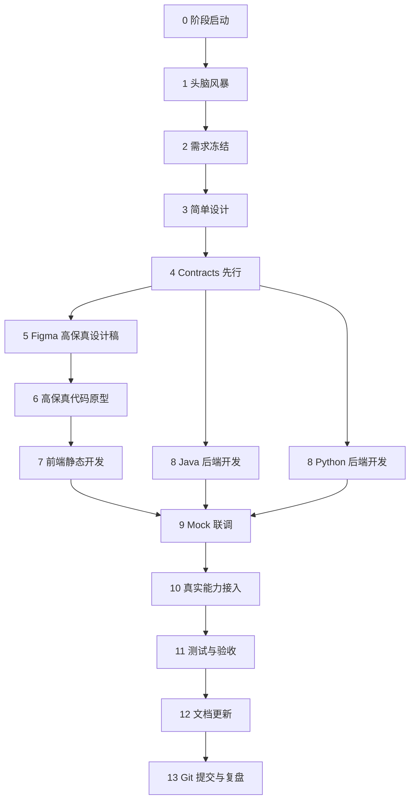

# 阶段交付规范

> 本文件是 `mimic-harness` 的项目级硬性规范。  
> 所有 Phase 都必须遵守本文件，不能把它当成参考建议。  
> 本文件规定每个 Phase 怎么从想法走到可运行交付。  
> 目标是避免“想到哪写到哪”，让每一阶段都能稳定产出：需求清楚、原型可看、前后端可跑、测试可验收、文档可复盘。

## 0. 规范等级

本文件和 `01_CODE_RULES_ZH.md` 同级，属于必须遵守的项目规范。

硬规则：

```text
没有阶段生产目录，不允许开始该 Phase。
没有完成头脑风暴、需求冻结、简单设计，不允许写业务代码。
Contracts 没有先行，不允许前后端并行开发。
有前端页面的 Phase，没有 Figma 高保真设计稿，不允许进入高保真代码原型。
Mock 联调没跑通，不允许接真实模型、数据库、RAG、MQ。
测试和验收记录没补，不允许标记 Phase 完成。
```

任何例外都必须写入：

```text
phases/phase-xx/README.md
```

并说明原因、风险、补救计划。

## 1. 标准流程总览

每个 Phase 必须按这个顺序推进：

```text
0. 阶段启动
1. 头脑风暴
2. 需求冻结
3. 简单设计
4. Contracts 先行
5. Figma 高保真设计稿
6. 高保真代码原型
7. 前端静态开发
8. 后端双语言并行开发
9. Mock 联调
10. 真实能力接入
11. 测试与验收
12. 文档更新
13. Git 提交与阶段复盘
```

硬性原则：

```text
先想清楚，再写接口。
先做可看的，再接真实的。
先 mock 跑通，再接模型和数据库。
Java 和 Python 同构推进。
每个阶段都必须有一个可演示闭环。
每个阶段必须有独立生产目录。
```

## 1.1 阶段生产目录

每个阶段必须创建独立生产目录：

```text
mimic-harness/phases/phase-01/
mimic-harness/phases/phase-02/
mimic-harness/phases/phase-03/
```

阶段目录用于保存：

```text
阶段启动
头脑风暴
需求冻结
简单设计
Contracts 产物登记
Figma 设计稿登记
原型产物登记
前后端产物登记
联调记录
测试记录
验收记录
复盘记录
```

规则：

```text
生产源码仍然放在 contracts/、frontend/、services/、infra/。
phases/phase-xx/ 记录本阶段生产了什么、为什么做、如何验收。
没有 phase 目录，不允许开始写该阶段代码。
```

## 2. Phase 工作流图



## 3. 0 阶段启动

目标：

```text
明确这一阶段为什么做、做到什么程度、哪些东西不做。
```

输入：

```text
02_DEVELOPMENT_PLAN_ZH.md 中对应 Phase
上一阶段复盘
当前代码状态
当前文档状态
```

输出：

```text
阶段目标
阶段范围
不做清单
验收标准草稿
风险点
```

示例：

```text
Phase 1 目标：前端高保真工作台可以通过 SSE 消费 Java/Python mock 流。
不做：真实模型、数据库持久化、用户登录、RAG、真实工具调用。
```

## 4. 1 头脑风暴

目标：

```text
把可能方案都摊开，但不急着写代码。
```

需要讨论：

```text
用户要完成什么动作
前端需要哪些页面和状态
后端需要哪些接口
Java/Python 是否能同构实现
哪些数据需要保存
哪些能力先 mock
哪些异常必须处理
是否影响后续 Phase
```

产出：

```text
方案备选
取舍理由
初版功能清单
初版页面清单
初版接口清单
```

注意：

```text
头脑风暴阶段允许发散。
但不能直接进入编码。
```

## 5. 2 需求冻结

目标：

```text
把这一阶段到底做什么写死，防止开发中持续加需求。
```

必须冻结：

```text
功能范围
页面范围
接口范围
数据范围
异常范围
验收标准
不做清单
```

产出：

```text
Phase Scope
Acceptance Criteria
Out of Scope
```

例子：

```text
本阶段做 Runtime Switch。
支持 Java / Python 两个选项。
不做多租户，不做登录，不做真实模型 Key 保存。
```

## 6. 3 简单设计

目标：

```text
在写代码前，把模块职责和调用链画清楚。
```

设计内容：

```text
前端页面结构
前端组件结构
前端粗线框图或大概视觉图
后端分层结构
接口调用链
数据流转
错误处理
日志和 Trace 点
```

产出：

```text
简单架构图
前端粗线框图
调用链说明
核心类/组件清单
状态机或流程图
```

要求：

```text
设计只做到能指导开发，不做过度设计。
每个设计都必须能落到代码目录。
有前端页面的 Phase，简单设计必须给出前端粗线框图，不能只有文字描述。
```

## 7. 4 Contracts 先行

目标：

```text
前后端先对齐协议，再分别开发。
```

必须先定义：

```text
OpenAPI
Request DTO
Response DTO
SSE Event
错误码
TraceEvent
JSON Schema
```

产出位置：

```text
contracts/openapi/
contracts/events/
contracts/schemas/
```

门禁：

```text
Contracts 没有定，不允许进入真实前后端开发。
```

原因：

```text
Java 和 Python 双后端最怕接口各写各的。
Contracts 是两套后端和前端的共同语言。
```

## 8. 5 Figma 高保真设计稿

目标：

```text
在写前端代码前，先把产品信息架构、视觉风格、关键页面、组件状态和交互路径定清楚。
```

必须覆盖：

```text
产品封面
页面清单
简单设计阶段的前端粗线框图输入
设计系统 token
核心组件 variants
核心页面高保真 frame
桌面端布局
移动端布局
空状态
加载状态
错误状态
禁用状态
Trace / AgentOps 展示状态
开发交付标注
素材清单
```

产出：

```text
Figma 文件链接或文件 ID
Figma 页面结构说明
设计系统说明
关键页面截图
交互原型路径
前端开发 handoff 清单
```

门禁：

```text
Figma 关键页面没定，不允许进入高保真代码原型。
没有状态设计，不允许进入前端静态开发。
没有开发标注，不允许让前端凭感觉写样式。
```

说明：

```text
Figma 负责定视觉、结构、组件和交互预期。
代码原型负责验证真实动态、SSE、响应式、错误恢复和工程可维护性。
二者都要有，但顺序必须是 Figma 先于代码原型。
```

## 9. 6 高保真代码原型

目标：

```text
先把用户能看到的东西做出来，但数据可以是 mock。
```

使用：

```text
Next.js
React
Tailwind CSS
shadcn/ui
lucide-react
Mock 数据
Mock SSE
```

必须覆盖：

```text
正常状态
加载状态
空状态
错误状态
禁用状态
移动端状态
```

产出：

```text
可运行页面
核心组件
mock 数据
截图验收
```

门禁：

```text
页面看不懂，不允许进入联调。
关键状态没做，不允许进入联调。
移动端严重错位，不允许进入联调。
```

## 10. 7 前端静态开发

目标：

```text
把高保真原型整理成可维护的前端代码。
```

工作内容：

```text
拆组件
整理 feature 目录
整理 shared/ui
接入 api-client 壳子
写类型定义
写状态管理
准备环境变量
准备素材目录
```

目录要求：

```text
features/chat
features/trace
features/tools
features/settings
entities/message
entities/run
shared/api
shared/ui
shared/config
```

产出：

```text
不接真实后端也能运行的前端静态版。
```

## 11. 8 后端双语言并行开发

目标：

```text
Java 和 Python 按同一份 contracts 实现同一个能力。
```

推进方式：

```text
先 Java 骨架
再 Python 对齐
再抽同构命名
再补测试
```

两套后端必须保持：

```text
接口路径一致
DTO 字段一致
SSE 事件一致
错误结构一致
TraceEvent 一致
日志语义一致
目录分层一致
```

Java 开发：

```text
Controller
UseCase
Domain
Port
Infrastructure
Test
```

Python 开发：

```text
Router
UseCase
Domain
Port
Infrastructure
Test
```

门禁：

```text
只写 Java 不写 Python，不算完成。
只写 Python 不写 Java，不算完成。
接口字段不一致，不允许联调。
```

## 12. 9 Mock 联调

目标：

```text
前端先和 mock 后端跑通闭环。
```

联调顺序：

```text
前端 -> Java Mock
前端 -> Python Mock
Java Mock -> contract tests
Python Mock -> contract tests
前端 Runtime Switch
SSE 流式事件
错误状态
```

必须验证：

```text
请求能发出
SSE 能不断接收
取消运行有效
错误能展示中文
Trace 面板能显示事件
Java/Python 切换不改代码
```

门禁：

```text
Mock 联调没跑通，不允许接真实模型。
```

## 13. 10 真实能力接入

目标：

```text
在 mock 闭环稳定后，替换为真实能力。
```

真实能力包括：

```text
真实模型 Provider
真实数据库
真实 Redis
真实工具
真实 RAG
真实文件存储
真实 MQ
```

规则：

```text
每次只替换一个真实能力。
替换前必须有 mock 对照。
替换后必须保留 mock fallback。
真实能力失败时必须有中文错误和 Trace。
```

例子：

```text
先 MockLlmClient 跑通。
再接 QwenLlmClient。
Qwen 失败时降级到 Doubao。
Doubao 失败时降级到 Mock。
```

## 14. 11 测试与验收

目标：

```text
证明这一阶段真的完成，而不是只在本机某一次碰巧跑通。
```

测试类型：

```text
单元测试
Contract Test
SSE Test
前端组件测试
E2E Test
Java/Python 一致性测试
异常测试
截图验收
```

最低要求：

```text
Java 测试通过
Python 测试通过
前端 lint/build 通过
关键链路手工跑通
错误状态手工跑通
```

验收记录必须写：

```text
运行命令
测试结果
手工验证路径
已知问题
下一阶段遗留
```

## 15. 12 文档更新

目标：

```text
代码变了，文档也必须变。
```

必须更新：

```text
对应模块 README
02_DEVELOPMENT_PLAN_ZH.md
Contracts 文档
运行说明
故障排查
```

如果涉及这些能力，还要更新：

```text
05_DATA_FLOW_STORAGE_LOOP_ZH.md
06_FRONTEND_DESIGN_ASSET_PIPELINE_ZH.md
```

门禁：

```text
只写代码不更新文档，不算阶段完成。
```

## 16. 13 Git 提交与阶段复盘

目标：

```text
让每个 Phase 都能独立回看、独立回滚、独立说明。
```

提交前检查：

```text
git status
git diff --check
前端检查
Java 检查
Python 检查
文档检查
敏感信息检查
```

提交信息格式：

```text
feat(phase-1): 完成 contracts 与 mock sse 闭环
docs(phase-0): 整理项目入口和文档总控
test(phase-2): 补充 agent loop 一致性测试
```

复盘内容：

```text
本阶段完成了什么
哪些验收已通过
哪些问题延期
下一阶段第一件事是什么
```

## 17. 不同类型 Phase 的调整

### 17.1 前端重的 Phase

例如：

```text
Phase 1
Phase 6
Phase 8
Phase 12
```

流程重点：

```text
Figma 高保真设计稿
高保真原型
组件状态
截图验收
移动端适配
交互验收
```

### 17.2 后端重的 Phase

例如：

```text
Phase 2
Phase 3
Phase 4
Phase 5
Phase 7
Phase 9
```

流程重点：

```text
Contracts
Domain 设计
Port 设计
Java/Python 同构
异常和日志
集成测试
```

### 17.3 基础设施重的 Phase

例如：

```text
Phase 12
```

流程重点：

```text
Dockerfile
docker-compose
环境变量
健康检查
部署脚本
回滚脚本
安全检查
```

## 18. 单阶段完成定义

一个 Phase 完成，必须同时满足：

```text
需求已冻结
Contracts 已更新
涉及前端时 Figma 设计稿已交付
前端可运行
Java 可运行
Python 可运行
联调通过
测试通过
文档更新
没有硬编码密钥
有中文日志
有中文异常
有验收记录
```

只满足其中一部分，只能叫“开发中”，不能叫“完成”。
