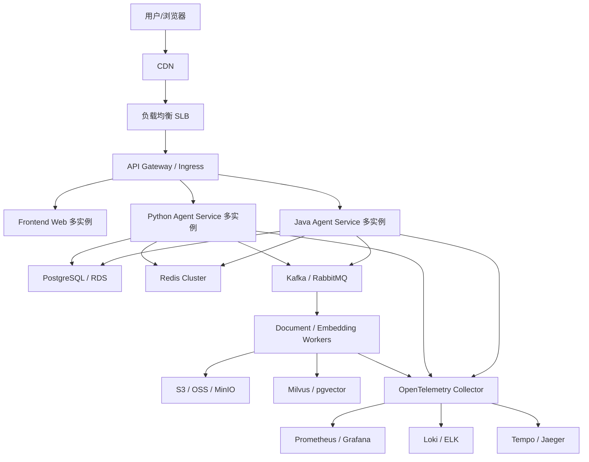

# 面试版集群架构设计方案

> 本文件用于面试表达。  
> 真实运行环境只有 `2 核 4G`，所以本项目本地只跑 core profile。  
> 但面试时要能讲清楚：如果流量上来，如何从单机演进到大厂集群架构。

## 1. 一句话定位

可以这样讲：

```text
我本地用 2 核 4G 单机 Docker Compose 跑通核心链路，
但代码设计上保留了 Gateway、Port、Adapter、EventBus、VectorStore、Trace、ObjectStorage 等抽象。
所以它不是写死在单机里的 Demo，而是可以从单机平滑演进到多实例、消息队列、向量库、对象存储和可观测平台的工程化 Agent Harness。
```

## 2. 运行版和面试版区别

| 维度 | 2核4G运行版 | 面试集群版 |
| --- | --- | --- |
| 部署 | Docker Compose core profile | Kubernetes / 多机 Docker / 云容器服务 |
| 网关 | Nginx / Caddy 单实例 | 多副本网关 + SLB |
| 前端 | 单实例 Next.js | CDN + 多实例 |
| Java Agent | 单实例 | 多副本 + 水平扩容 |
| Python Agent | 单实例 | 多副本 + 专门跑 AI/工具/RAG worker |
| 主库 | PostgreSQL 单实例 | 云 RDS / 主从 / 读写分离 |
| 缓存 | Redis 单实例 | Redis Cluster |
| MQ | Redis Streams / RabbitMQ | Kafka / Pulsar |
| 对象存储 | 本地目录 / MinIO | S3 / OSS / TOS / COS |
| 向量库 | pgvector | Milvus / Zilliz / Pinecone |
| 日志 | 中文结构化日志 + trace_events | Loki / ELK |
| Trace | PostgreSQL trace_events | Tempo / Jaeger / OpenTelemetry |
| 发布 | Compose 脚本 | CI/CD + GitOps |

重点：

```text
运行版证明我能做出可运行闭环。
面试版证明我知道如何工程化扩展。
```

## 3. 集群总体架构



## 4. 请求链路怎么讲

面试时按这条主链路讲：

```text
用户在前端发起聊天
  -> 网关生成 requestId
  -> 路由到 Java/Python Agent Service
  -> 创建 runId 和 threadId
  -> 保存 user message 到 PostgreSQL
  -> 从 Redis 读取短期状态和限流信息
  -> 加载最近消息、摘要记忆、RAG context
  -> 调用模型或工具
  -> 通过 SSE 流式返回前端
  -> 同步保存 message/run/trace_event
  -> 异步投递评测、摘要、归档任务到 MQ
```

关键表达：

```text
主链路尽量短，保证 SSE 低延迟。
慢任务异步化，例如文档解析、Embedding、评测、Trace 归档。
可回放数据落 PostgreSQL，临时态放 Redis，大文件放对象存储，向量放向量库。
```

## 5. 服务如何拆

第一阶段单机：

```text
frontend-web
java-agent
python-agent
postgres
redis
gateway
```

集群阶段：

```text
frontend-web
agent-gateway
java-agent-service
python-agent-service
tool-service
rag-service
memory-service
trace-service
document-worker
embedding-worker
eval-worker
```

拆分原则：

1. 主聊天链路先不拆太碎。
2. 慢任务优先拆 worker。
3. 工具执行和 RAG 可以从 agent-service 内部模块逐步拆成独立服务。
4. 所有拆分都通过 Port / Adapter 保持业务层稳定。

## 6. 数据层怎么讲

### 6.1 PostgreSQL / RDS

负责：

```text
Thread
Message
Run
RunStep
TraceEvent
ToolCall
Memory
Document metadata
ModelUsage
FallbackRecord
```

演进：

```text
单机 PostgreSQL
  -> 云 RDS
  -> 读写分离
  -> 按 tenant / thread 分片
```

### 6.2 Redis Cluster

负责：

```text
run state
cancel signal
rate limit
model health cache
recent messages cache
distributed lock
轻量队列
```

演进：

```text
Redis 单实例
  -> Redis Sentinel
  -> Redis Cluster
```

### 6.3 MQ

负责：

```text
document.parse.requested
embedding.requested
memory.summary.requested
eval.run.requested
trace.archive.requested
```

演进：

```text
Redis Streams
  -> RabbitMQ
  -> Kafka / Pulsar
```

面试重点：

```text
聊天 SSE 主链路不强依赖 MQ。
MQ 处理慢任务和可重试任务。
消息必须有 eventId，消费者必须幂等。
```

### 6.4 向量库

负责：

```text
document chunk embedding
topK search
metadata filter
hybrid search
```

演进：

```text
pgvector
  -> Milvus standalone
  -> Milvus cluster / Zilliz
```

面试重点：

```text
主库保存文档元数据和 chunk 原文。
向量库保存 embedding 和检索索引。
RAG 返回必须带 source、chunkId、score。
```

## 7. 高可用怎么讲

可以按组件讲：

```text
网关：多副本 + SLB
Agent 服务：无状态多副本，靠 threadId/runId 查状态
PostgreSQL：云 RDS、主从、备份、PITR
Redis：Cluster 或 Sentinel
MQ：多副本、ack、重试、死信队列
对象存储：云对象存储天然高可用
向量库：Milvus 分片和副本
观测：Prometheus/Grafana/日志/Trace 分离
```

Agent 服务尽量无状态：

```text
会话状态在 PostgreSQL。
短期运行状态在 Redis。
大文件在对象存储。
向量在向量库。
服务实例可以随时扩缩容。
```

## 8. 限流、降级、熔断怎么讲

限流：

```text
按 userId / apiKey / ip / model provider 做 Redis 计数。
```

降级：

```text
Provider 降级：Qwen -> Doubao -> Zhipu -> Mock
Model 降级：pro -> lite
能力降级：vision -> text-only
工具降级：web_search -> local_search
架构降级：multi-agent -> single-agent
```

熔断：

```text
模型超时率过高，短时间内不再选择该 provider。
工具失败率过高，临时关闭该 tool。
RAG 服务不可用时，退化为纯聊天。
```

面试金句：

```text
Agent 系统不能因为一个模型厂商、一个工具、一个向量库不可用就整体失败。
失败要可观测、可降级、可恢复。
```

## 9. 一致性怎么讲

强一致：

```text
用户消息保存
run 状态变化
tool call 记录
模型 usage 记录
```

最终一致：

```text
文档解析
Embedding
摘要记忆
评测任务
Trace 归档
```

处理方式：

```text
主链路事务保证核心数据。
异步任务用 eventId 幂等。
消费者失败重试。
最终状态写回 task 表。
```

## 10. 可观测性怎么讲

每次请求至少有：

```text
requestId
runId
threadId
userId
runtime
provider
model
stepNo
```

观测数据：

```text
日志：中文结构化日志
指标：请求量、失败率、耗时、token、模型调用次数
Trace：run_started、model_call、tool_call、fallback、run_finished
前端：TraceTimeline 可回放
```

面试表达：

```text
我把 Agent run 当成一个可回放工作流，而不是黑盒聊天。
每一步都会产生 TraceEvent，前端和后端都能按 runId 追踪。
```

## 11. 扩容路径怎么讲

按阶段说：

```text
阶段 1：2核4G 单机 core profile 跑通。
阶段 2：单机增加 MinIO、RabbitMQ、Grafana。
阶段 3：Agent 服务多实例，前面加 SLB。
阶段 4：PostgreSQL 迁云 RDS，Redis 迁 Cluster。
阶段 5：文档解析和 Embedding 拆 worker。
阶段 6：pgvector 切 Milvus。
阶段 7：RabbitMQ/Redis Streams 切 Kafka。
阶段 8：Docker Compose 切 Kubernetes/GitOps。
```

核心：

```text
每一步都有可运行替代，不会一次性重构。
```

## 12. 面试回答模板

问题：你这个项目只有单机，怎么体现大厂架构？

回答：

```text
我本地确实只有 2 核 4G，所以运行版不会硬上 Kafka、Milvus、K8s。
但我没有把系统写成单体 Demo，而是保留了大厂架构形态：

第一，服务上拆成 frontend、java-agent、python-agent、gateway。
第二，代码上用 Port/Adapter，把 MQ、向量库、对象存储、缓存、Trace 都抽象出来。
第三，单机版用 Redis Streams 替代 Kafka，用 pgvector 替代 Milvus，用 Docker Compose profiles 替代 K8s，用 trace_events 和中文结构化日志替代 ELK/Tempo。
第四，这些替代方案都能跑通真实链路，不是只画架构图。
第五，如果流量上来，可以把 Light Adapter 换成 Heavy Adapter，例如 Redis Streams 换 Kafka，pgvector 换 Milvus，Compose 换 K8s，而业务层不用大改。
```

问题：为什么聊天主链路不走 MQ？

回答：

```text
聊天是 SSE 流式场景，用户关心首 token 延迟和连续输出。
所以主链路是同步编排，保证低延迟。
MQ 用在慢任务和可重试任务，比如文档解析、Embedding、摘要记忆、评测和 Trace 归档。
```

问题：怎么保证 Java/Python 双后端一致？

回答：

```text
我用 contracts-first。
OpenAPI、SSE event、JSON Schema 先定义，再让 Java 和 Python 分别实现。
测试上用同一批 eval cases 和 contract tests 校验两套 runtime 输出同构事件。
```

## 13. 面试图示口诀

可以按这张逻辑图讲：

```text
入口层：CDN / SLB / Gateway
应用层：Frontend / Java Agent / Python Agent / Workers
状态层：PostgreSQL / Redis / Object Storage / Vector DB
异步层：EventBus / MQ
智能层：Model Provider / Tool / RAG / Multi-Agent
观测层：Log / Metrics / Trace / Dashboard
发布层：Docker Compose -> Kubernetes
```

记住一句：

```text
我运行在单机，但设计按集群边界切。
```
