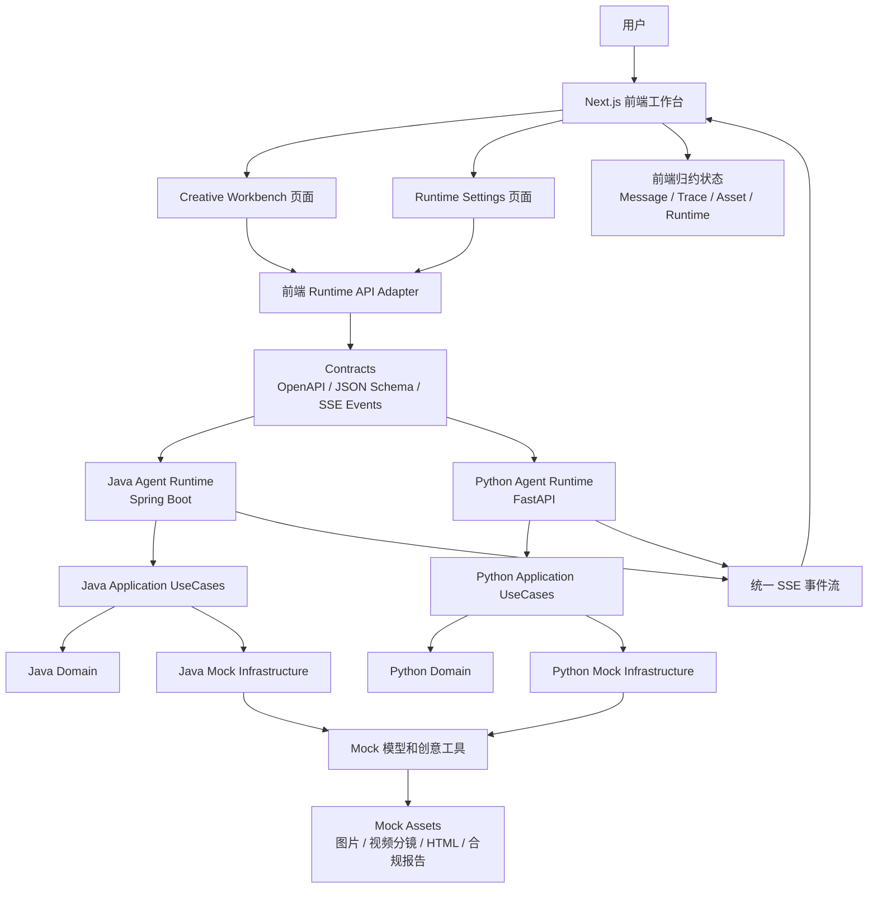
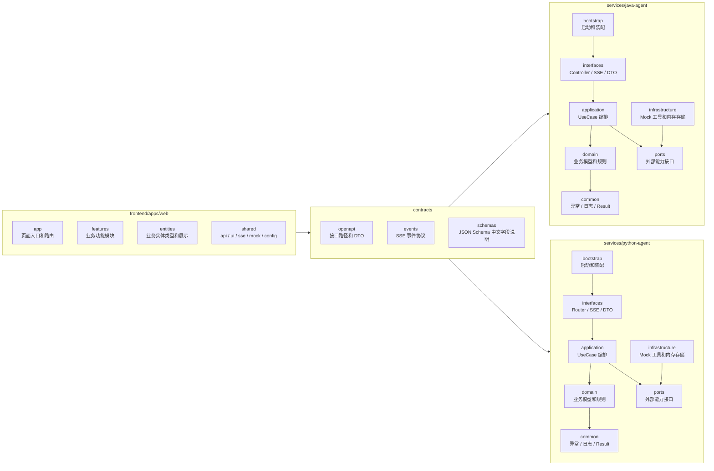
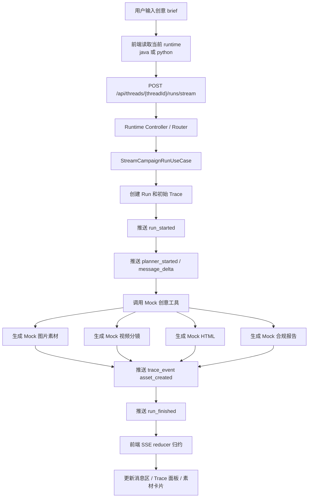
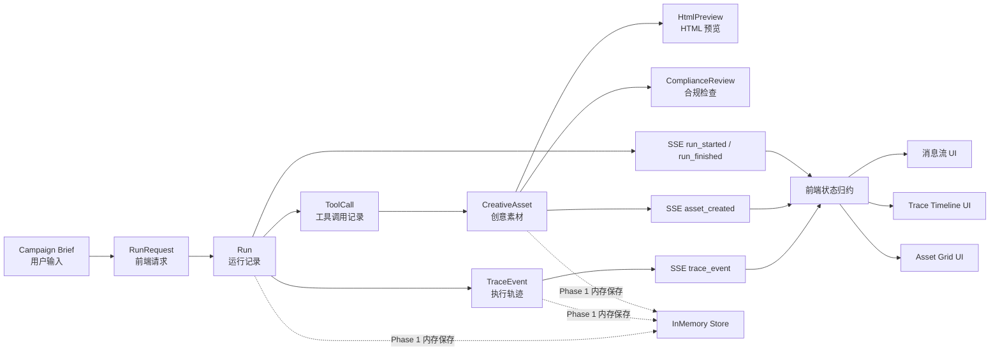
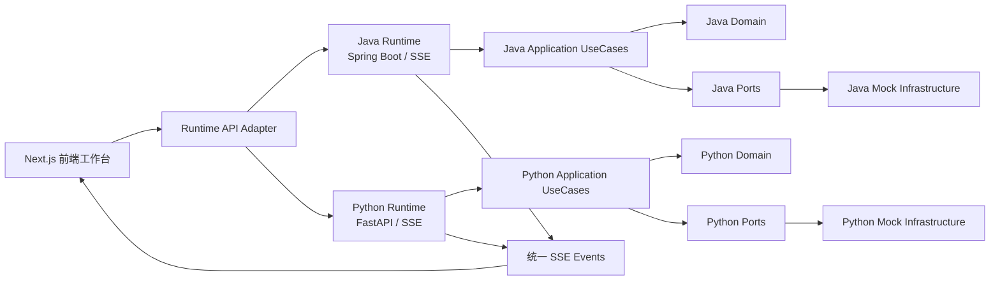
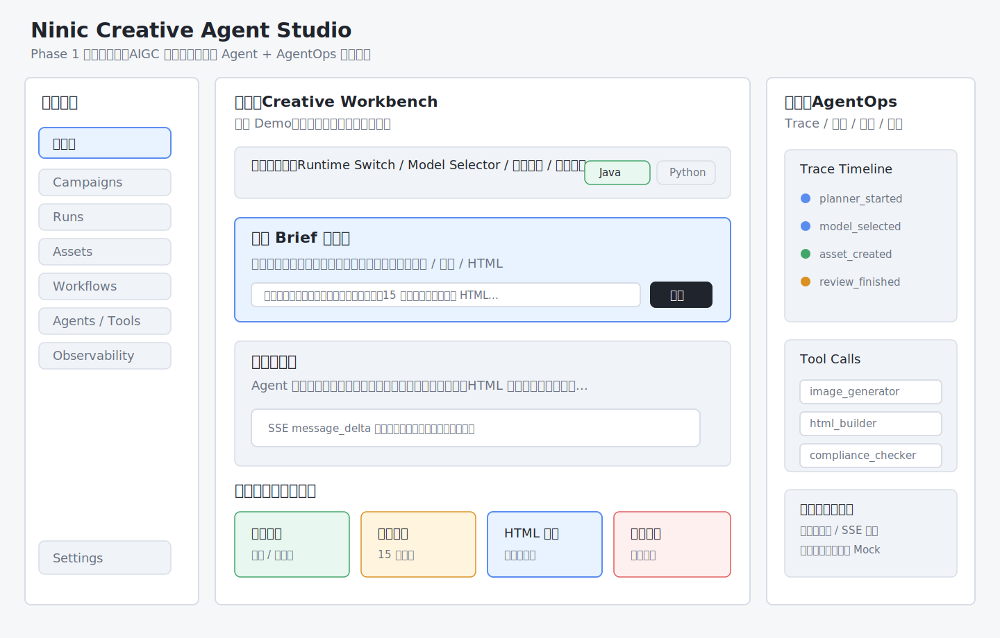
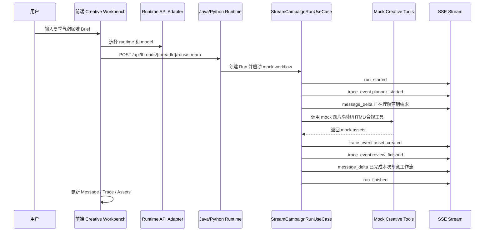

# 04. Phase 1 简单设计

> 本文件是 Phase 1 的简单设计。  
> 目标是把需求冻结落到真实工程结构、模块职责、调用链、数据流、错误处理和 Trace 点。  
> 本文件不是最终详细设计，不写业务代码，但后续 Contracts、前端、Java、Python 都必须按这里落地。

## 1. 当前阶段

```text
Phase：Phase 1
步骤：3. 简单设计
上一产物：03_PHASE_SCOPE_ZH.md
下一步骤：4. Contracts 先行
```

本阶段简单设计只覆盖 Phase 1。

产品蓝图中的 16 个能力域和 131 个接口只是当前基线，后续可以按开发进度取舍增删。

Phase 1 必须稳定落地的是：

```text
1. 中型产品的信息架构。
2. 前端工程化模块边界。
3. Java / Python 后端层级 modules。
4. AIGC Campaign Mock SSE 主链路。
5. Trace、Asset、HTML Preview、Compliance 的 mock 数据流。
6. Contracts 先行所需的接口、事件和 schema 输入。
```

## 2. 设计大图

### 2.1 一图看懂 Phase 1

这张图先看整体方向：

```text
用户只操作前端工作台。
前端只认 contracts。
Java / Python 两套 Runtime 按同一套 contracts 输出同构 SSE。
Phase 1 的模型、工具、素材、合规检查都来自 mock infrastructure。
```



### 2.2 工程分层大图

这张图看“代码应该放哪里”：



### 2.3 一次生成请求大图

这张图看“从点击生成到页面更新”的主链路：



### 2.4 数据流转大图

这张图看“数据在哪里产生、在哪里保存、在哪里展示”：



### 2.5 总体架构



设计原则：

```text
前端只关心 contracts，不关心 Java/Python 内部实现。
Java/Python 通过同一套 contracts 输出同构事件。
Phase 1 不接真实模型，所有模型、工具、资产、合规结果来自 mock infrastructure。
业务规则放 domain，流程编排放 application，对外协议放 interfaces。
```

## 3. 前端简单设计

### 3.0 前端大概图

> 这张图是 Phase 1 前端的第一版粗线框图。  
> 它不是最终 Figma 设计稿，只用于先确定页面大概长什么样、区域怎么分、核心信息放在哪里。  
> 下一步 Figma 阶段必须在这张图基础上继续细化视觉、组件、状态、标注和移动端。



布局说明：

```text
左侧：产品导航，承载 Workbench、Campaigns、Runs、Assets、Tools、Observability、Settings。
中间：Creative Workbench 主操作区，承载 Runtime 控制、Brief 输入、SSE 流式消息、素材预览。
右侧：AgentOps 调试区，承载 Trace Timeline、Tool Calls、错误和降级状态。
底部：四类核心产物卡片，图片、视频分镜、HTML 预览、合规报告。
```

这一版先解决：

```text
1. 用户一眼看懂这是 AIGC 创意生产工作台。
2. 面试官一眼看懂这里不是普通聊天，而是有 AgentOps 和 Trace 的工程产品。
3. 前端开发知道页面要拆成 Sidebar、Workbench、TracePanel、AssetGrid 四大区域。
4. Figma 阶段知道要重点细化哪些组件和状态。
```

### 3.1 前端目录结构

```text
frontend/apps/web/
  app/
    (workspace)/
      layout.tsx
      page.tsx
      campaigns/page.tsx
      campaigns/[campaignId]/page.tsx
      runs/page.tsx
      runs/[runId]/page.tsx
      assets/page.tsx
      assets/[assetId]/page.tsx
      workflows/page.tsx
      workflows/[workflowId]/page.tsx
      agents/page.tsx
      tools/page.tsx
      models/page.tsx
      knowledge/page.tsx
      prompts/page.tsx
      observability/page.tsx
      evals/page.tsx
      settings/page.tsx
      deploy/page.tsx

  features/
    creative-workbench/
    agent-runtime/
    asset-center/
    html-preview/
    compliance-review/
    trace-observability/
    runtime-settings/
    placeholder-pages/

  entities/
    runtime/
    model/
    campaign/
    brief/
    thread/
    message/
    run/
    trace-event/
    tool-call/
    creative-asset/
    html-preview/
    compliance-review/
    error/

  shared/
    api/
    contracts/
    ui/
    hooks/
    lib/
    config/
    mock/
    sse/
    telemetry/
    styles/
```

### 3.2 前端核心组件

`features/creative-workbench`：

```text
CreativeWorkbenchPage
WorkbenchHeader
CampaignSidebar
BriefComposer
StreamingMessagePanel
AssetPreviewGrid
WorkflowSummaryBar
```

`features/agent-runtime`：

```text
RuntimeSwitch
ModelSelector
ProviderHealthBadge
RuntimeStatusPanel
```

`features/trace-observability`：

```text
TraceTimeline
TraceEventItem
ToolCallsPanel
FallbackNotice
RunMetricsStrip
```

`features/asset-center`：

```text
CreativeAssetCard
ImageAssetCard
VideoStoryboardCard
HtmlAssetCard
ComplianceAssetCard
```

`shared/sse`：

```text
createSseRunClient
parseSseEvent
reduceRunEvent
handleSseError
```

### 3.3 前端状态设计

前端状态拆成 5 类：

```text
runtimeState      当前选择 Java / Python，健康状态，模型选择
runState          当前 runId、运行状态、开始时间、结束时间
messageState      用户消息、助手流式消息
traceState        TraceEvent 列表、当前步骤、失败步骤
assetState        图片、视频分镜、HTML、合规检查四类资产
```

状态来源：

```text
初始页面：shared/mock
发起运行：POST /api/threads/{threadId}/runs/stream
运行过程：SSE
运行后查询：GET /api/runs/{runId}/trace、GET /api/assets
```

### 3.4 前端事件归约

SSE 到 UI 的归约规则：

```text
run_started
  -> 创建 runState
  -> 清空上一次 trace 和 assets

message_delta
  -> 追加到 StreamingMessagePanel

trace_event
  -> 追加到 TraceTimeline
  -> 如果 type 是 asset_created，同时写入 assetState
  -> 如果 type 是 tool_call_started / tool_call_finished，同时更新 ToolCallsPanel

run_finished
  -> runState.status = succeeded
  -> 展示完成状态

run_failed
  -> runState.status = failed
  -> 展示中文错误
```

## 4. Java 后端简单设计

### 4.1 Java Maven modules

```text
services/java-agent/
  pom.xml
  creative-agent-common/
  creative-agent-domain/
  creative-agent-ports/
  creative-agent-application/
  creative-agent-infrastructure/
  creative-agent-interfaces/
  creative-agent-bootstrap/
```

依赖方向：

```text
common -> 无业务依赖
domain -> common
ports -> domain + common
application -> domain + ports + common
infrastructure -> ports + domain + common
interfaces -> application + domain + common
bootstrap -> interfaces + application + infrastructure + common
```

### 4.2 Java 核心类

`creative-agent-common`：

```text
MimicResult
BusinessException
ErrorCode
IdGenerator
ClockProvider
LogContext
```

`creative-agent-domain`：

```text
RuntimeType
CampaignBrief
Thread
Message
Run
RunStatus
TraceEvent
TraceEventType
ToolCall
CreativeAsset
CreativeAssetType
HtmlPreview
ComplianceReview
```

`creative-agent-ports`：

```text
RunEventPublisherPort
MockModelPort
CreativeToolPort
AssetRepositoryPort
TraceRepositoryPort
RuntimeHealthPort
```

`creative-agent-application`：

```text
ListRuntimesUseCase
ListModelsUseCase
CreateThreadUseCase
ListThreadsUseCase
ListMessagesUseCase
StreamCampaignRunUseCase
GetRunTraceUseCase
ListAssetsUseCase
GetAssetUseCase
CreateHtmlPreviewUseCase
CreateComplianceReviewUseCase
```

`creative-agent-infrastructure`：

```text
MockCampaignPlanner
MockImageGenerator
MockVideoStoryboardGenerator
MockHtmlGenerator
MockComplianceReviewer
InMemoryThreadStore
InMemoryRunStore
InMemoryAssetStore
JavaRuntimeHealthAdapter
```

`creative-agent-interfaces`：

```text
HealthController
RuntimeController
ModelController
ThreadController
RunController
AssetController
HtmlPreviewController
ComplianceController
SseEventMapper
ErrorResponseMapper
```

`creative-agent-bootstrap`：

```text
CreativeAgentApplication
ApplicationConfig
MockInfrastructureConfig
WebConfig
```

## 5. Python 后端简单设计

### 5.1 Python package modules

```text
services/python-agent/
  app/
    common/
    domain/
    ports/
    application/
    infrastructure/
    interfaces/
    bootstrap/
```

依赖方向和 Java 保持一致：

```text
common -> 无业务依赖
domain -> common
ports -> domain + common
application -> domain + ports + common
infrastructure -> ports + domain + common
interfaces -> application + domain + common
bootstrap -> interfaces + application + infrastructure + common
```

### 5.2 Python 核心文件

`app/common`：

```text
result.py
errors.py
error_code.py
id_generator.py
clock.py
log_context.py
```

`app/domain`：

```text
runtime/models.py
campaign/models.py
thread/models.py
message/models.py
run/models.py
trace/models.py
tool/models.py
asset/models.py
html/models.py
compliance/models.py
```

`app/ports`：

```text
event_publisher.py
mock_model.py
creative_tool.py
asset_repository.py
trace_repository.py
runtime_health.py
```

`app/application`：

```text
runtime/list_runtimes_use_case.py
model/list_models_use_case.py
thread/create_thread_use_case.py
thread/list_threads_use_case.py
message/list_messages_use_case.py
run/stream_campaign_run_use_case.py
run/get_run_trace_use_case.py
asset/list_assets_use_case.py
asset/get_asset_use_case.py
html/create_html_preview_use_case.py
compliance/create_compliance_review_use_case.py
```

`app/infrastructure`：

```text
mock/campaign_planner.py
mock/image_generator.py
mock/video_storyboard_generator.py
mock/html_generator.py
mock/compliance_reviewer.py
memory/thread_store.py
memory/run_store.py
memory/asset_store.py
runtime/runtime_health_adapter.py
```

`app/interfaces`：

```text
rest/health_router.py
rest/runtime_router.py
rest/model_router.py
rest/thread_router.py
rest/run_router.py
rest/asset_router.py
rest/html_preview_router.py
rest/compliance_router.py
sse/sse_event_mapper.py
dto/
mapper/
```

`app/bootstrap`：

```text
main.py
container.py
settings.py
router_registry.py
```

## 6. Contracts 简单设计

第 4 步 Contracts 先行时，按本设计调整。

### 6.1 OpenAPI tags

```text
Runtime
Models
Threads
Runs
Assets
HtmlPreview
Compliance
Observability
```

Phase 1 不把全部 131 个接口写进正式 OpenAPI。

Phase 1 正式 OpenAPI 只放 M 类接口：

```text
GET  /api/health
GET  /api/runtimes
GET  /api/runtimes/{runtime}
GET  /api/models
GET  /api/threads
POST /api/threads
GET  /api/threads/{threadId}
GET  /api/threads/{threadId}/messages
POST /api/threads/{threadId}/runs/stream
GET  /api/runs
GET  /api/runs/{runId}
GET  /api/runs/{runId}/trace
GET  /api/assets
GET  /api/assets/{assetId}
POST /api/html/previews
GET  /api/html/previews/{previewId}
POST /api/compliance/reviews
GET  /api/compliance/reviews/{reviewId}
```

### 6.2 JSON Schema

需要补齐：

```text
runtime.schema.json
model.schema.json
campaign.schema.json
asset.schema.json
html-preview.schema.json
compliance.schema.json
error.schema.json
```

已有 schema 需要调整：

```text
message.schema.json
run.schema.json
trace.schema.json
```

## 7. 主链路调用设计



## 8. 数据流设计

Phase 1 不落真实数据库。

数据保存策略：

```text
前端：React state / mock data。
Java：InMemoryThreadStore、InMemoryRunStore、InMemoryAssetStore。
Python：memory store。
Contracts：所有字段按 JSON Schema 约束。
```

数据生命周期：

```text
Brief 输入
  -> RunRequest
  -> Run
  -> TraceEvent
  -> ToolCall
  -> CreativeAsset / HtmlPreview / ComplianceReview
  -> SSE 推送
  -> 前端归约到 messageState / traceState / assetState
```

## 9. 错误处理设计

统一错误模型：

```text
code
message
detail
requestId
runId
runtime
createdAt
```

错误映射：

```text
RUNTIME_UNAVAILABLE       前端无法连接 runtime
SSE_CONNECT_FAILED        SSE 建连失败
SSE_STREAM_INTERRUPTED    SSE 中断
RUN_FAILED                后端返回 run_failed
INVALID_REQUEST           请求字段缺失或非法
INVALID_RUNTIME           runtime 不是 java / python
UNKNOWN_EVENT_TYPE        前端收到未知事件
INVALID_ASSET_PAYLOAD     asset_created 数据不完整
EMPTY_HTML_PREVIEW        HTML 预览为空
```

前端行为：

```text
错误必须展示中文说明。
错误面板必须显示 runtime、runId、错误码。
允许用户重新运行 mock flow。
不能静默失败。
```

后端行为：

```text
接口错误返回 ErrorResponse。
SSE 运行错误发送 run_failed。
日志必须包含 runId、threadId、runtime、errorCode。
```

## 10. Trace 与日志点

必须产出的 Trace 点：

```text
run_started
planner_started
planner_finished
model_selected
tool_call_started: image_mock_generator
asset_created: image
tool_call_finished: image_mock_generator
tool_call_started: video_storyboard_mock_generator
asset_created: video_storyboard
tool_call_finished: video_storyboard_mock_generator
tool_call_started: html_mock_generator
asset_created: html
tool_call_finished: html_mock_generator
review_started
asset_created: compliance_report
review_finished
run_finished
```

必须产出的中文日志：

```text
[开始创意工作流运行] runId={} threadId={} runtime={}
[选择 Mock 模型] runId={} provider={} model={}
[开始 Mock 工具调用] runId={} toolName={}
[生成 Mock 资产] runId={} assetId={} assetType={}
[完成合规检查] runId={} reviewId={}
[创意工作流运行完成] runId={} durationMs={}
[创意工作流运行失败] runId={} errorCode={} reason={}
```

## 11. Phase 1 文件产物设计

下一步 Contracts 先行预计改动：

```text
contracts/openapi/agent-api.yaml
contracts/events/sse-events.md
contracts/events/sse-events.schema.json
contracts/schemas/runtime.schema.json
contracts/schemas/model.schema.json
contracts/schemas/campaign.schema.json
contracts/schemas/message.schema.json
contracts/schemas/run.schema.json
contracts/schemas/trace.schema.json
contracts/schemas/tool.schema.json
contracts/schemas/asset.schema.json
contracts/schemas/html-preview.schema.json
contracts/schemas/compliance.schema.json
contracts/schemas/error.schema.json
```

后续前端预计新增：

```text
frontend/apps/web/app/
frontend/apps/web/features/
frontend/apps/web/entities/
frontend/apps/web/shared/
```

后续 Java 预计新增：

```text
services/java-agent/pom.xml
services/java-agent/creative-agent-common/
services/java-agent/creative-agent-domain/
services/java-agent/creative-agent-ports/
services/java-agent/creative-agent-application/
services/java-agent/creative-agent-infrastructure/
services/java-agent/creative-agent-interfaces/
services/java-agent/creative-agent-bootstrap/
```

后续 Python 预计新增：

```text
services/python-agent/app/common/
services/python-agent/app/domain/
services/python-agent/app/ports/
services/python-agent/app/application/
services/python-agent/app/infrastructure/
services/python-agent/app/interfaces/
services/python-agent/app/bootstrap/
```

## 12. 进入 Contracts 先行的门禁

进入第 4 步前必须确认：

```text
1. 本文件已经登记到 phases/phase-01/README.md。
2. Phase 1 正式 M 接口清单已经明确。
3. SSE 事件和 trace_event.type 已经明确。
4. CreativeAsset / HtmlPreview / ComplianceReview 必须进入 schema。
5. Java/Python modules 边界已经明确。
6. 前端 app / features / entities / shared 边界已经明确。
```

满足后，可以进入：

```text
4. Contracts 先行
```
