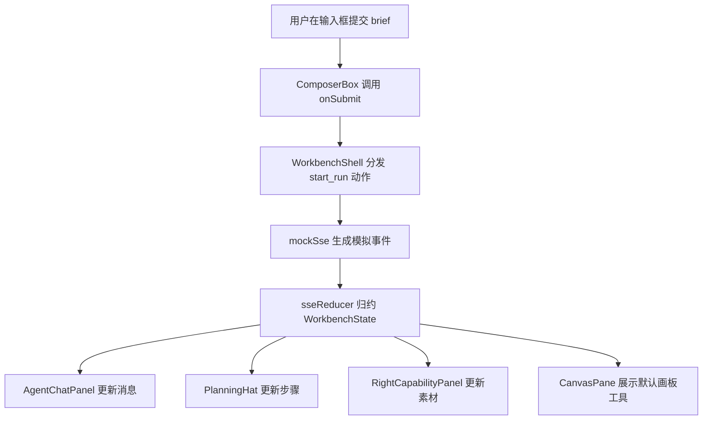

# 11. Phase 1.7 前端静态开发规划

> 本文件是 Phase 1.7 的开发规划文档。  
> Phase 1.7 不继续发散产品需求，也不接真实后端。  
> 本阶段的目标是把 Phase 1.6 已经能看的高保真代码原型，整理成后续可以长期维护、可以联调、可以让 Java 开发者看懂的前端静态工程。

## 1. 阶段信息

```text
阶段：Phase 1.7
名称：前端静态开发
日期：2026-06-21
上一阶段：Phase 1.6 高保真代码原型
下一阶段：Phase 1.8 后端双语言并行开发
当前状态：规划中
```

输入材料：

```text
docs/01_CODE_RULES_ZH.md
docs/09_PHASE_DELIVERY_PROCESS_ZH.md
phases/phase-01/04_SIMPLE_DESIGN_ZH.md
phases/phase-01/08_DESIGN_BASELINE_ACCEPTANCE_ZH.md
phases/phase-01/09_CODE_PROTOTYPE_START_ZH.md
phases/phase-01/10_CODE_PROTOTYPE_VALIDATION_ZH.md
contracts/openapi/agent-api.yaml
contracts/events/sse-events.schema.json
contracts/schemas/*.schema.json
frontend/apps/web/
当前 localhost:3026 前端页面
```

输出产物：

```text
frontend/apps/web/src/features/workbench/
frontend/apps/web/src/entities/
frontend/apps/web/src/shared/api/
frontend/apps/web/src/shared/config/
frontend/apps/web/src/shared/ui/
frontend/apps/web/src/shared/sse/
frontend/apps/web/src/shared/mock/
phases/phase-01/12_PHASE1_7_FIGMA_PROTOTYPE_BASELINE_ZH.md
phases/phase-01/13_PHASE1_7_FRONTEND_STATIC_VALIDATION_ZH.md
```

## 2. 阶段目标

Phase 1.6 已经解决“页面大概像不像、交互是否成立”的问题。  
Phase 1.7 要解决“代码是否能继续长大”的问题。

本阶段目标：

```text
1. 保留当前已确认的视觉风格和交互，不重新设计页面。
2. 把 CreativeWorkbenchPage.tsx 中过长的页面逻辑拆成可维护组件。
3. 把 mock 数据、实体类型、状态归约、UI 组件、配置、API 壳子分层。
4. 为后续 Java / Python mock SSE 联调准备前端 API 边界。
5. 为后续真实生图、生视频、生 HTML、工作流接入留下清楚的扩展点。
6. 继续保持全中文页面、中文日志、中文注释。
```

重要基线：

```text
当前运行中的前端页面是 Phase 1.7 的唯一视觉和交互基线。
Figma 页面只作为历史记录和辅助说明，不作为像素级强约束。
组件拆分、目录整理、状态抽取都不能让当前前端页面回退。
```

一句话版本：

```text
这一阶段不追新功能，先把前端工程地基夯实。
```

## 3. 本阶段不做

Phase 1.7 明确不做：

```text
1. 不接真实大模型。
2. 不接真实 Java / Python 后端。
3. 不接真实数据库、Redis、MQ、RAG、对象存储。
4. 不做真实图片编辑算法。
5. 不做真实文件上传。
6. 不做登录鉴权。
7. 不新增大范围产品功能。
8. 不推翻当前已经确认的白灰极简工作台风格。
```

允许做：

```text
1. 保留 mock 数据。
2. 新增前端 api-client 壳子。
3. 新增 SSE parser / reducer 壳子。
4. 新增目录、类型、组件拆分。
5. 修正由于拆分带来的小范围样式问题。
6. 补充中文注释、中文日志、中文异常兜底文案。
```

## 4. 当前问题

当前 `CreativeWorkbenchPage.tsx` 已经承担了太多职责：

```text
1. 页面布局。
2. 左侧会话列表。
3. 中间 Agent 对话。
4. 规划帽子。
5. 输入框。
6. 右侧能力面板。
7. 画板模式。
8. 拖拽宽度。
9. 动画时长计算。
10. mock 数据展示。
11. 多个产品面板。
```

这对高保真原型阶段可以接受，但对后续联调和学习不友好：

```text
1. Java 开发者很难快速定位“入口、总控、组件、状态、接口”。
2. 后续接 SSE 时容易把网络逻辑塞进页面组件。
3. 后续接双后端时容易出现 Java/Python runtime 判断散落各处。
4. 后续页面继续变多时，单文件会越来越难维护。
```

所以 Phase 1.7 的核心动作是：

```text
拆分，但不重写。
整理，但不改产品方向。
抽边界，但不做过度抽象。
```

## 5. 目标目录结构

Phase 1.7 结束后，前端目录建议调整为：

```text
frontend/apps/web/src/
  app/
    page.tsx
    settings/page.tsx

  entities/
    asset/
      types.ts
    message/
      types.ts
    run/
      types.ts
    runtime/
      types.ts
    trace/
      types.ts

  features/
    workbench/
      components/
        WorkbenchShell.tsx
        ConversationListPanel.tsx
        AgentChatPanel.tsx
        PlanningHat.tsx
        ComposerBox.tsx
        RightCapabilityPanel.tsx
        CanvasPane.tsx
        AssetPanel.tsx
        WorkflowPanel.tsx
        HtmlPreviewPanel.tsx
        ExportPanel.tsx
      model/
        workbenchState.ts
        workbenchReducer.ts
        mockWorkbenchData.ts
      api/
        workbenchApi.ts
      README.md

    settings/
      components/
        RuntimeSettingsPage.tsx
      model/
        mockRuntimeData.ts

  shared/
    api/
      httpClient.ts
      runtimeClient.ts
    config/
      runtime.ts
    lib/
      cn.ts
    mock/
      delay.ts
      mockSse.ts
    sse/
      sseEventTypes.ts
      sseParser.ts
      sseReducer.ts
    ui/
      IconButton.tsx
      PanelResizeHandle.tsx
      Tooltip.tsx
```

目录含义：

```text
app        只放 Next.js 路由入口，不写复杂业务。
entities   放业务实体类型，让前后端字段有共同语言。
features   放业务功能模块，工作台和设置页分开。
shared     放可复用基础能力，不依赖具体业务页面。
```

## 6. 总控文件规划

Phase 1.7 必须保留一个“总控文件”，方便小白先从入口看懂页面怎么拼起来。

建议总控文件：

```text
features/workbench/components/WorkbenchShell.tsx
```

总控文件只负责：

```text
1. 组合左侧会话区、中间对话区、右侧能力区、画板区。
2. 维护左右面板宽度、展开收起状态。
3. 维护当前右侧能力 tab。
4. 维护当前是否进入画板模式。
5. 把事件回调下发给子组件。
```

总控文件禁止：

```text
1. 禁止直接写大段 mock 数据。
2. 禁止直接解析 SSE。
3. 禁止直接写 HTTP 请求。
4. 禁止塞入所有右侧面板的 JSX。
5. 禁止把细碎按钮样式全部写在总控里。
```

## 7. 组件拆分规划

### 7.1 WorkbenchShell

职责：

```text
页面总装配。
控制左右面板宽度。
控制画板模式。
控制右侧能力面板选中项。
```

关键状态：

```text
leftPanelWidth        左侧会话列表当前宽度。
rightPanelWidth       右侧能力面板当前宽度。
activeCapability      当前右侧能力：画板、素材、工作流、网页、导出。
isCanvasMode          是否进入画板编辑态。
isChatCollapsed       画板模式下对话区是否收起。
```

中文注释要求：

```text
每个状态字段都必须说明业务含义。
拖拽收起阈值必须注释为什么是这个数。
动画时长计算必须注释为什么和宽度成比例。
```

### 7.2 ConversationListPanel

职责：

```text
左侧会话列表。
支持展开、收起、拖拽到竖条。
支持点击某个会话后打开中间对话区。
```

关键交互：

```text
1. 展开态展示搜索框、置顶创意、项目会话、最近对话。
2. 收起态合并成一列，不再出现双竖条。
3. 画板模式下，对话框拖拉到左侧后可以直接消失。
4. 点击某个对话可以重新打开对话区。
```

### 7.3 AgentChatPanel

职责：

```text
中间 Agent 对话区。
展示用户 brief、Agent 回复、规划帽子、输入框。
```

关键原则：

```text
1. 默认中间必须有一个 Agent，而不是空白页面。
2. 不要重新放大块产品介绍。
3. 对话气泡和规划帽子间距必须稳定。
4. 输入框贴近底部，但不能和页面边缘挤在一起。
```

### 7.4 PlanningHat

职责：

```text
输入框上方的当前计划状态。
默认只展示 01 规划。
点击后展开 1/2/3/4 竖向待办列表。
```

关键原则：

```text
1. 收起态和展开态与对话气泡的间隔必须一致。
2. 展开列表必须是竖排一行一个事项。
3. 完成项显示勾选。
4. 未完成项显示空框。
5. 超过 3 条允许滚动，但隐藏滚动条和分割线。
6. 字体和高度不能过大，避免展开后占满半屏。
```

### 7.5 ComposerBox

职责：

```text
底部输入框。
左侧加号用于上传图片占位。
右侧放语音和发送按钮。
按钮必须在输入框内部。
```

关键原则：

```text
1. 发送按钮使用白底黑图标。
2. 语音按钮使用 lucide 麦克风图标。
3. 上传按钮使用加号，不写“上传图片”大字。
4. 输入框高度比普通单行输入更高，留出多模态 brief 的空间。
```

### 7.6 RightCapabilityPanel

职责：

```text
右侧产品能力面板。
承载画板、素材、工作流、网页、导出。
```

关键原则：

```text
1. 右侧面板可拖拽宽度。
2. 可收成 48px 工具竖条。
3. 动画时长和展开宽度成比例，不能啪一下跳出来。
4. 面板内部不要出现无意义重边框。
```

### 7.7 CanvasPane

职责：

```text
画板编辑态。
用于展示 Agent 生成图片后的继续编辑能力。
```

关键原则：

```text
1. 画板从右侧展开，把对话推到左边。
2. 默认选中第一个画板工具。
3. 默认打开画板工具抽屉。
4. 工具按钮悬浮在画板内部右侧，不再占独立竖条。
5. 画板模式下对话区可收起。
6. 对话区收起时，画板底部显示微信气泡式入口或语音入口。
7. 对话区展开时，隐藏画板内部的小语音按钮。
```

## 8. 状态管理规划

Phase 1.7 先不用复杂状态库，优先用 React 内置能力：

```text
useState
useMemo
useCallback
useReducer
```

推荐拆分：

```text
workbenchState.ts    定义 WorkbenchState。
workbenchReducer.ts  定义前端事件如何改变状态。
mockWorkbenchData.ts 定义静态 mock 初始数据。
```

WorkbenchState 建议字段：

```text
activeThreadId        当前会话 ID。
activeRunId           当前运行 ID。
activeRuntime         当前 runtime，java 或 python。
messages              当前消息列表。
planSteps             当前规划步骤。
assets                当前素材列表。
traceEvents           当前 Trace 事件。
toolCalls             当前工具调用记录。
activeCapability      当前右侧能力面板。
isCanvasMode          是否画板模式。
isStreaming           是否正在模拟流式生成。
lastErrorMessage      最近一次中文错误提示。
```

注释要求：

```text
每个字段旁边必须有中文注释。
字段注释要解释业务含义，不要只翻译变量名。
```

## 9. API 壳子规划

Phase 1.7 不接真实后端，但要先把接口边界做出来。

目录：

```text
shared/api/httpClient.ts
shared/api/runtimeClient.ts
features/workbench/api/workbenchApi.ts
```

### 9.1 httpClient.ts

职责：

```text
统一封装 fetch。
统一处理 baseUrl。
统一处理中文错误。
统一输出中文日志。
```

Phase 1.7 只做壳子：

```text
真实请求可以暂时不发出。
但函数签名要接近 contracts。
```

### 9.2 runtimeClient.ts

职责：

```text
根据当前 runtime 选择 Java 或 Python 的 baseUrl。
```

当前配置来源：

```text
shared/config/runtime.ts
```

### 9.3 workbenchApi.ts

职责：

```text
提供工作台需要的前端 API 方法。
```

建议方法：

```text
startMockRun(threadId, request)
cancelMockRun(runId)
listMockThreads()
listMockAssets(runId)
```

后续真实接口映射：

```text
POST /api/threads/{threadId}/runs/stream
POST /api/runs/{runId}/cancel
GET  /api/threads
GET  /api/runs/{runId}/assets
```

## 10. SSE 壳子规划

Phase 1.7 先准备前端 SSE 事件归约，不要求连接真实 SSE。

目录：

```text
shared/sse/sseEventTypes.ts
shared/sse/sseParser.ts
shared/sse/sseReducer.ts
shared/mock/mockSse.ts
```

职责：

```text
sseEventTypes.ts  对齐 contracts/events/sse-events.schema.json。
sseParser.ts      把 EventSource 或 ReadableStream 文本解析成事件对象。
sseReducer.ts     把事件对象归约成 WorkbenchState。
mockSse.ts        用 setTimeout 或 async generator 模拟事件流。
```

Phase 1.7 必须保留中文日志：

```text
console.info("[前端SSE] 收到运行开始事件", event);
console.info("[前端SSE] 收到素材创建事件", event);
console.warn("[前端SSE] 收到未知事件类型", event);
console.error("[前端SSE] 解析事件失败", error);
```

## 11. 数据流设计

Phase 1.7 的前端静态数据流：



注意：

```text
组件不直接互相改状态。
组件只触发事件。
WorkbenchShell 或 reducer 统一处理状态变化。
```

## 12. 注释和日志门禁

用户已经明确要求：

```text
注释级别要高。
关键字段、关键状态、关键节点都要有中文注释。
```

Phase 1.7 执行规则：

```text
1. 每个组件文件顶部写中文职责注释。
2. 每个 props 字段写中文注释。
3. 每个核心状态字段写中文注释。
4. 每个拖拽函数写中文注释。
5. 每个动画计算函数写中文注释。
6. 每个 API 壳子函数写中文注释。
7. 每个 SSE 事件处理分支写中文注释。
8. 每个 mock 数据字段写中文注释或在类型中写中文说明。
```

日志规则：

```text
1. 前端交互日志必须中文。
2. 日志必须能说明用户动作或状态变化。
3. 不写 console.log("aaa")、console.log("test")。
4. 错误日志必须保留 error 对象。
```

示例：

```ts
console.info("[前端工作台] 用户切换右侧能力面板", { capability });
console.warn("[前端工作台] 面板拖拽宽度低于阈值，自动收起", { width });
console.error("[前端SSE] Mock 事件归约失败", error);
```

## 13. 开发顺序

Phase 1.7 建议按下面顺序推进：

```text
1. 对照当前运行前端页面，确认当前界面不能回退。
2. 建立目标目录。
3. 拆出 entities 类型。
4. 拆出 mock 数据。
5. 拆出 shared/ui 小组件。
6. 拆出 PlanningHat 和 ComposerBox。
7. 拆出 ConversationListPanel。
8. 拆出 RightCapabilityPanel。
9. 拆出 CanvasPane。
10. 建立 WorkbenchShell 总控。
11. 建立 shared/api 壳子。
12. 建立 shared/sse 壳子。
13. 接入 mockSse 到 reducer。
14. 跑 build。
15. 跑浏览器截图验收。
16. 更新 README 和阶段验证文档。
```

重要约束：

```text
每拆一个组件，必须保证页面还能运行。
不要一次性大爆炸式重构。
每次拆分后至少跑 TypeScript / build 检查。
```

## 14. 验收标准

Phase 1.7 完成时必须满足：

```text
1. 页面仍然可以访问 http://localhost:3026。
2. / 和 /settings 均能正常构建。
3. 主工作台视觉和 Phase 1.6 当前确认版本保持一致。
4. 画板默认选中第一个工具，并默认打开画板工具抽屉。
5. 左侧列表、右侧面板、画板推拉交互仍然可用。
6. 输入框、规划帽子、对话气泡间距不回退。
7. CreativeWorkbenchPage.tsx 不再承担所有页面细节。
8. WorkbenchShell 能作为总控入口被小白读懂。
9. mock 数据、实体类型、组件、API 壳子、SSE 壳子分层清晰。
10. 新增和重构代码有足够中文注释。
11. 不出现英文用户可见文案。
12. 不出现无作用按钮。
13. 不出现多余重边框、双竖条、停航母级空白边距回退。
```

命令验收：

```bash
npm run build
```

浏览器验收：

```text
默认工作台截图
左侧列表展开截图
左侧列表收起截图
右侧能力面板展开截图
画板模式截图
画板默认工具抽屉截图
移动端截图
与当前运行前端页面对照，Figma 页面只作为参考记录
```

验收记录文件：

```text
phases/phase-01/13_PHASE1_7_FRONTEND_STATIC_VALIDATION_ZH.md
```

## 15. 风险和处理

### 15.1 拆组件导致样式回退

风险：

```text
当前样式经过多轮微调，拆组件时容易把间距、动画和收起态弄坏。
```

处理：

```text
每拆一个交互区域都截图对比。
不要把布局类名随手改名。
先移动代码，再抽象样式。
```

### 15.2 注释过多但没帮助

风险：

```text
每行都写废话注释，会让代码更难读。
```

处理：

```text
字段、状态、函数、分支必须中文说明。
简单 JSX 标签不写重复废话。
注释重点解释“为什么这么做”和“后续接什么”。
```

### 15.3 过早接真实接口

风险：

```text
静态开发阶段如果提前接真实后端，会把 UI 重构和联调问题搅在一起。
```

处理：

```text
Phase 1.7 只做 api-client 壳子和 mockSse。
真实 Java / Python 联调放到 Phase 1.9。
```

### 15.4 过度抽象

风险：

```text
为了工程化而拆太细，小白更看不懂。
```

处理：

```text
只按真实职责拆。
WorkBenchShell 保持可读。
shared 只放真正复用的东西。
```

## 16. 完成定义

Phase 1.7 只有同时满足下面条件，才算完成：

```text
1. 前端目录完成工程化整理。
2. 主页面交互不回退。
3. 构建通过。
4. 截图验收通过。
5. README 更新。
6. 13_PHASE1_7_FRONTEND_STATIC_VALIDATION_ZH.md 写完。
7. 下一阶段 Phase 1.8 可以直接开始 Java / Python 后端骨架。
```

最终结论：

```text
Phase 1.7 是从“能看”走向“能维护”的阶段。
它不追求新功能，而是把前端静态版变成后续双语言后端、Mock SSE 联调、真实能力接入都能依赖的工程底座。
```
